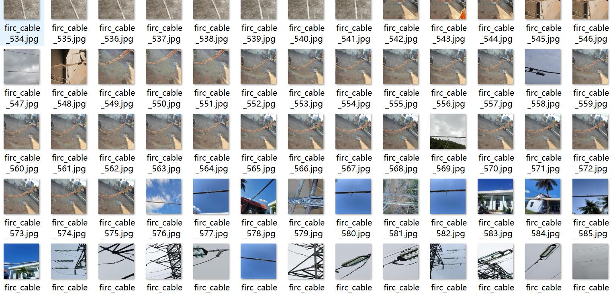
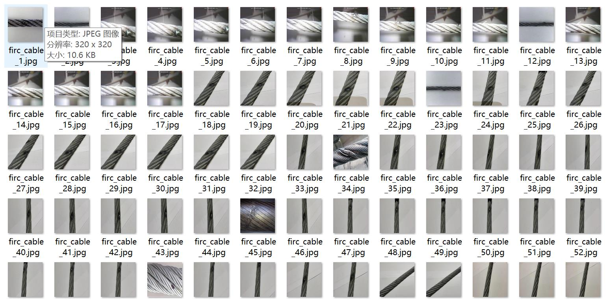
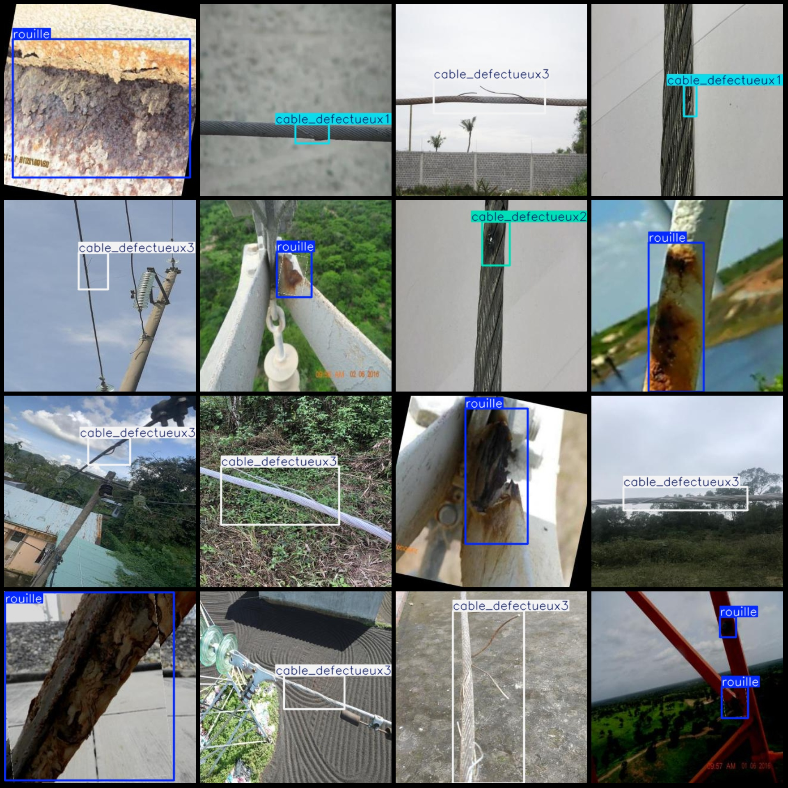
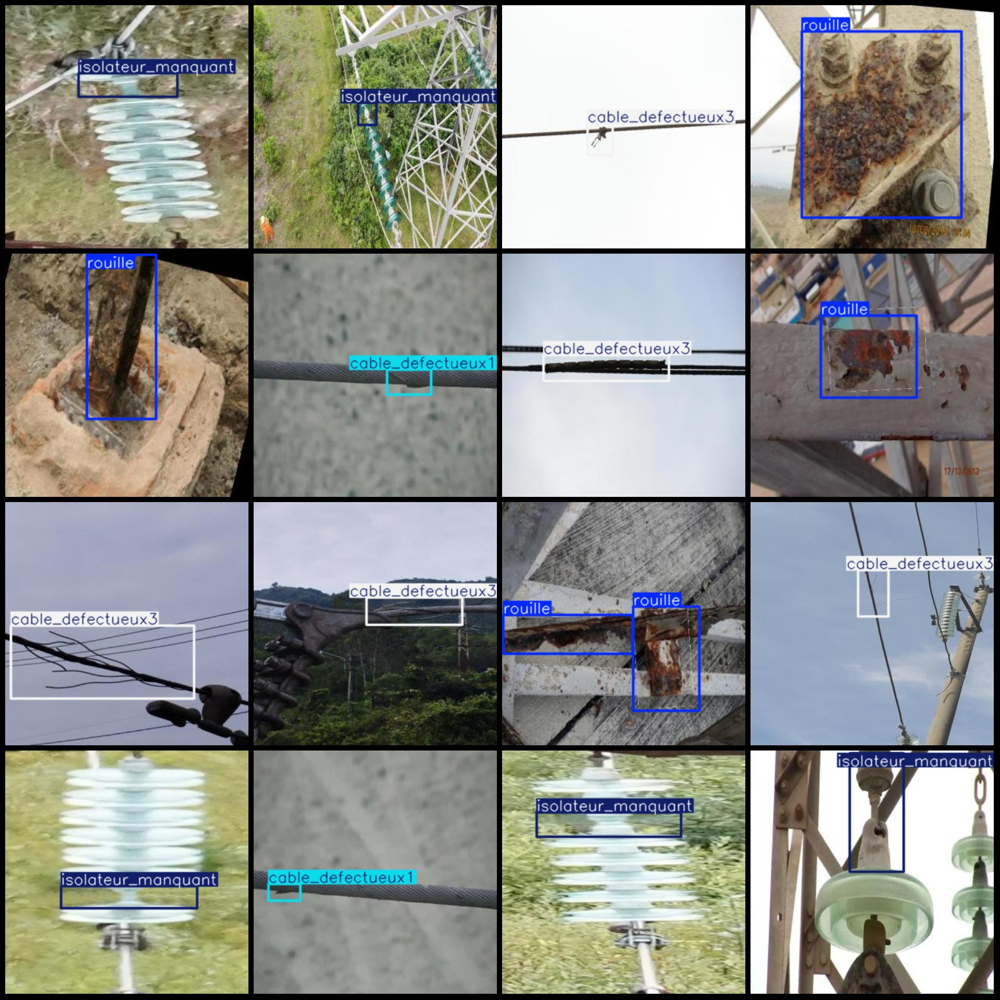

# Power Scene: Detection of Corrupted Metal Parts and Faulty Cable Connectors in Transmission Lines with 3429 Images in VOC+YOLO Format (5 Classes)

Please note that the image includes a large number of enhancements, mainly rotation and contrast enhancement. The resolution is only 320x320, which is determined to meet the requirements before purchasing.
Dataset format: Pascal VOC format + YOLO format (txt file without split path, only containing jpg images and corresponding VOC format xml files and yolo format txt files)
number of images: 3429  
Number of XML files: 3429
Number of txt files: 3429
Category count: 5
Annotation class names (yolo format) in this order are: ["cable_defectueux1", "cable_defectueux2", "cable_defectueux3", "isolateur_manquant", "rouille"]
Number of boxes labeled in each category:
Cable_Defective1(Structural damage in power transmission lines) box count = 423  
Cable_Defective2(Conductor exposed or outer sheath damaged) box count = 202  
Cable_Defective3(Connecting component abnormal) box count = 1359
"Isolator Manquant (Power Insulation Device Failure)" Frame Count = 772
Rouille (oxidation corrosion of metal parts) = 1358
Total frames: 4114
image resolution: 320x320  
Use annotation tool: labelImg
Annotation rules: Draw a rectangle around the class
Important notes: None
Special statement: This dataset does not guarantee the accuracy of the trained model or weight file.
Preview of the image:
## Images

Here is a pay link on Stripe ( https://buy.stripe.com/3cs8yP7sY87d0vu9AB ). Please contact me lonlonago@foxmail.com after funding $89, and I will send you a complete data files , thank you!

